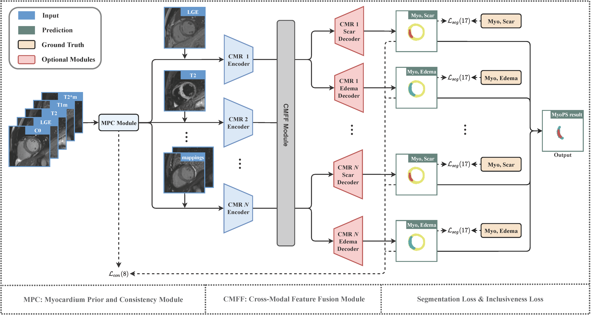

# MyoPS-Net
PyTorch implemetation for our paper "MyoPS-Net: Myocardial Pathology Segmentation with Flexible Combination of Multi-Sequence CMR images" (Accepted by MedIA).

## Introduction
Myocardial pathology segmentation (MyoPS) can be a prerequisite for the accurate diagnosis and treatment planning of myocardial infarction. However, achieving this segmentation is challenging, mainly due to the inadequate and indistinct information from an image. In this work, we develop an end-to-end deep neural network, referred to as MyoPS-Net, to flexibly combine five-sequence cardiac magnetic resonance (CMR) images for MyoPS. 

The proposed MyoPS-Net were evaluated on two datasets, i.e., a private one consisting of 50 paired multi-sequence CMR images and a public one from MICCAI2020 MyoPS Challenge (https://zmiclab.github.io/zxh/0/myops20/). Experimental results showed that MyoPS-Net could achieve state-of-the-art performance in various scenarios. Note that in practical clinics, the subjects may not have full sequences, such as missing LGE CMR or mapping CMR scans. We therefore conducted extensive experiments to investigate the performance of the proposed method in dealing with such complex combinations of different CMR sequences. Results proved the superiority and generalizability of MyoPS-Net, and more importantly, indicated a practical clinical application.

## Usage
To be updated.

## Citation and Acknowledge
@article{qiu2022myops,
  title={MyoPS-Net: Myocardial Pathology Segmentation with Flexible Combination of Multi-Sequence CMR Images},
  author={Qiu, Junyi and Li, Lei and Wang, Sihan and Zhang, Ke and Chen, Yinyin and Yang, Shan and Zhuang, Xiahai},
  journal={arXiv preprint arXiv:2211.03062},
  year={2022}
}
